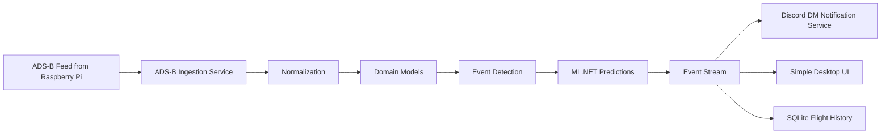
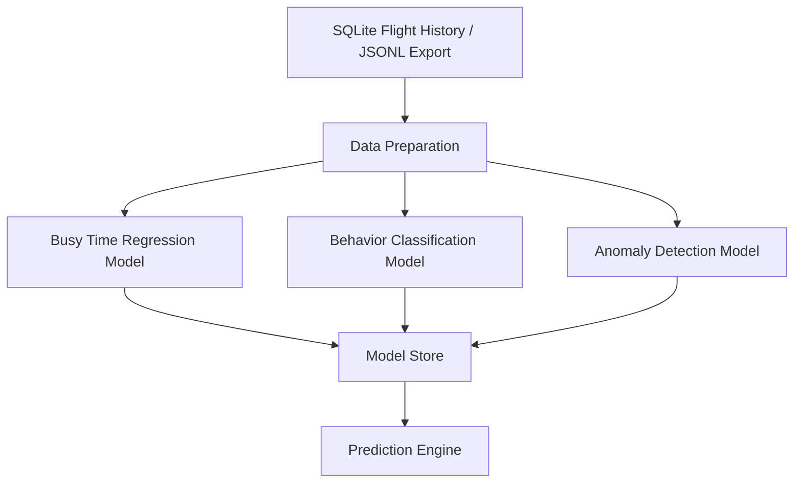
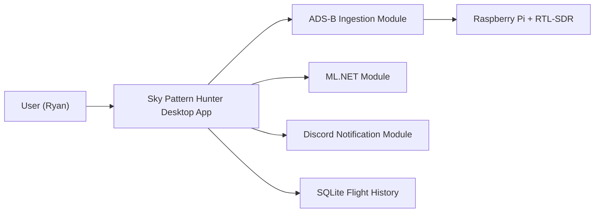
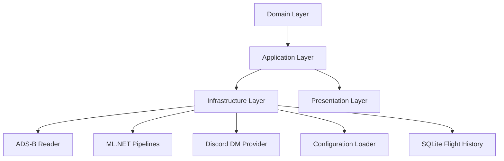
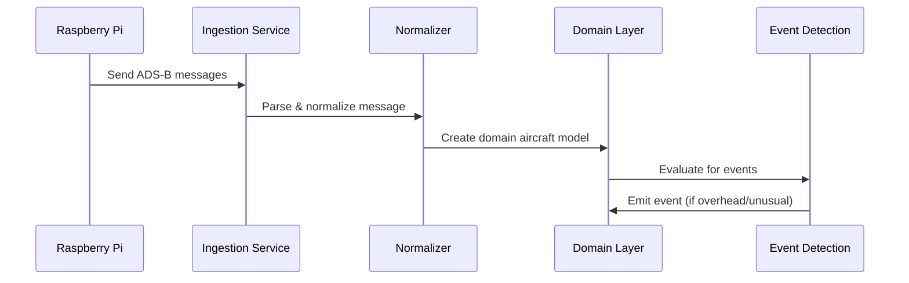
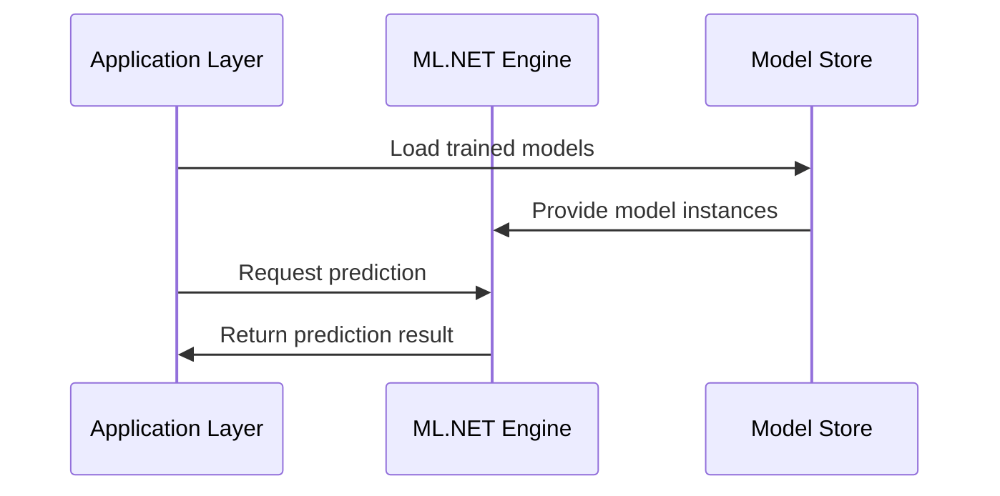
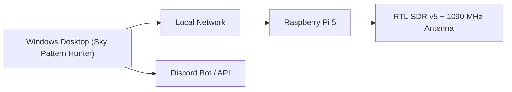

# Sky Pattern Hunter — Living Architecture Document
Version: 0.1.0  
Status: Draft  
Maintainer: Ryan W.

This document evolves with the system. Every architectural decision, change, and rationale is recorded here.

---

# 1. System Overview

Sky Pattern Hunter is a modular aircraft-tracking intelligence system built using Clean Architecture. It ingests ADS‑B signals, processes aircraft telemetry, applies ML.NET models, and triggers notifications through Discord direct messages.

The system is designed to run continuously with low CPU usage, high extensibility, and a simple user experience.

---

# 2. Architecture Goals

- High testability  
- Clean separation of concerns  
- Asynchronous APIs  
- Extendable to new antennas and data sources  
- Minimal external dependencies  
- Predictive analytics using ML.NET  
- Real-time event detection  
- Discord-based notifications for overhead events  
- A simple, approachable desktop UI for first-version usability  

---

# 3. Architecture Layers

## 3.1 Domain Layer
- Pure business logic  
- Aircraft models  
- Event models  
- ML prediction interfaces  
- No external dependencies  

## 3.2 Application Layer
- Use cases  
- Orchestrates workflows  
- Interfaces for infrastructure  

## 3.3 Infrastructure Layer
- ADS‑B ingestion  
- ML.NET pipelines  
- Discord DM provider  
- SQLite flight-session storage with retention controls and sampled path points
- Configuration loader  

## 3.4 Presentation Layer
- Simple Windows UI  
- Real-time aircraft list  
- Event viewer  
- Settings editor  

---

# 4. Data Flow Diagram (Mermaid)

---

# 5. ML Architecture Diagram (Mermaid)

---

# 6. System Context Diagram (Mermaid)

---

# 7. Component Diagram (Mermaid)

---

# 8. ADS‑B Ingestion Sequence Diagram (Mermaid)

---
# 9. ML Prediction Sequence Method (Mermaid)

---

# 10. Deployment Diagram (Mermaid)
